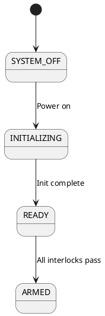
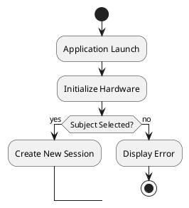

# TOSCA Architecture Documentation PDF Workflow

**Last Updated:** 2025-11-05
**Status:** Active

---

## Overview

This guide describes how to update TOSCA architecture documentation and automatically generate professional PDFs with embedded diagrams.

---

## When to Use `/create-architecture-documentation`

The slash command now includes **automatic PDF generation** as the final step. Use it when:

1. Updating existing architecture documentation
2. Adding new architecture documents
3. Creating new PlantUML diagrams
4. Making significant changes to multiple documents

---

## Standard Workflow

### Step 1: Invoke the Command

```bash
/create-architecture-documentation
```

This will:
- Analyze your architecture updates needed
- Update markdown documentation
- Create/update PlantUML diagrams
- **Automatically generate PDFs** with proper formatting

### Step 2: Automated Execution

The automation will:

1. **Update Documentation** - Edit markdown files with your new information
2. **Create Diagrams** - Generate PlantUML `.puml` files and convert to PNG
3. **Resize Images** - Optimize diagrams to 8 inch max (1200px at 150 DPI)
4. **Generate PDFs** - Create professional PDFs with:
   - Document title (28pt, bold)
   - "Index:" table of contents
   - Full page width diagrams
   - Professional code blocks (blue accent, shadows)
   - Optimized fonts and spacing

### Step 3: Review Output

```bash
# Check generated PDFs
ls -lh docs/architecture/pdfs/

# View specific PDF
xdg-open docs/architecture/pdfs/01_system_overview.pdf
```

---

## Manual PDF Generation (If Needed)

If you edit markdown files manually and need to regenerate PDFs:

### Quick Method (All PDFs):
```bash
cd docs/architecture/
python3 generate_pdfs.py --all
```

### Single Document:
```bash
cd docs/architecture/
python3 generate_pdfs.py --file 01_system_overview.md
```

### With New Diagrams:
```bash
cd docs/architecture/

# Generate PlantUML diagrams
cd diagrams/
plantuml -tpng *.puml
cd ..

# Resize images
python3 resize_images.py

# Generate PDFs
python3 generate_pdfs.py --all
```

---

## Directory Structure

```
docs/architecture/
    diagrams/
        *.puml              [PlantUML source files]
        output/png/         [Generated PNG diagrams]
    originals/              [Backup markdown files]
    pdfs/                   [Generated PDF documents]
    old_files/              [Archived old files]
    *.md files              [Architecture documentation]
    generate_pdfs.py        [PDF generation script]
    resize_images.py        [Image optimization script]
    pdf-generation-config.json
    pdf-styles.css
```

---

## Configuration Files

### `pdf-generation-config.json`
Maps diagrams to markdown files:

```json
{
  "diagram_mapping": {
    "01_system_overview.md": [
      "TOSCA System Context.png",
      "TOSCA Container Diagram.png",
      "safety-state-machine.png",
      "session-workflow.png"
    ]
  },
  "pdf_engine": "wkhtmltopdf",
  "pandoc_options": [
    "--css", "pdf-styles.css",
    "--toc",
    "--toc-depth=3",
    "-V", "margin-left=0.75in",
    "-V", "margin-right=0.75in",
    "-V", "margin-top=0.75in",
    "-V", "margin-bottom=0.75in"
  ]
}
```

### `pdf-styles.css`
Controls PDF appearance:
- Title: 28pt, bold, 3px border
- TOC label: "Index:"
- Code blocks: Blue accent bar, shadows, Consolas font
- Images: Full page width with negative margins
- Links: Black, no underline

---

## Common Tasks

### Task 1: Update Single Document
```bash
# Edit markdown
nano docs/architecture/03_safety_system.md

# Regenerate PDF
cd docs/architecture/
python3 generate_pdfs.py --file 03_safety_system.md
```

### Task 2: Add New Diagram to Existing Doc
```bash
cd docs/architecture/diagrams/

# Create PlantUML diagram
nano my-new-diagram.puml

# Generate PNG
plantuml -tpng my-new-diagram.puml

# Move to output
mv my-new-diagram.png output/png/

# Update config
cd ..
nano pdf-generation-config.json
# Add "my-new-diagram.png" to appropriate document

# Regenerate PDF
python3 generate_pdfs.py --file 01_system_overview.md
```

### Task 3: Change PDF Styling
```bash
# Edit CSS
nano docs/architecture/pdf-styles.css

# Regenerate all PDFs to see changes
python3 generate_pdfs.py --all
```

### Task 4: Full Documentation Update
```bash
# Use the slash command - it will do everything
/create-architecture-documentation
```

---

## PlantUML Diagram Types

### State Machine Example:


### Workflow Example:


---

## PDF Features

### Title and TOC:
- Document title appears first (28pt, bold)
- "Index:" label introduces table of contents
- Clickable links to sections
- Clean, professional layout

### Diagrams:
- Full page width (8.5 inches)
- Break out of text margins
- Centered on page
- Max 8 inch height (1200px at 150 DPI)
- High quality for print and screen

### Code Blocks:
- Blue accent bar on left (4px #0066cc)
- Light gray background (#f8f9fa)
- Consolas/Monaco monospace fonts
- Subtle shadow for depth
- 13pt font size optimized for readability

### Text:
- Body: 16pt (large, readable)
- Headers: 28pt (H1), 20pt (H2), 17pt (H3)
- Tables: 15pt
- Margins: 0.75 inches

---

## Backup Safety

**All original markdown files are backed up:**
- Location: `docs/architecture/originals/`
- Created: 2025-11-05 10:39
- Contains: 32 markdown files with original Unicode box-drawing characters

**To restore a file:**
```bash
cp docs/architecture/originals/01_system_overview.md docs/architecture/
```

---

## Troubleshooting

### Issue: PDFs not generating
**Check:**
```bash
which pandoc    # Pandoc installed?
which wkhtmltopdf  # PDF engine installed?
```

### Issue: Diagrams not appearing
**Check:**
```bash
ls docs/architecture/diagrams/output/png/  # PNGs exist?
cat pdf-generation-config.json  # Diagram mapping correct?
```

### Issue: PlantUML not working
**Check:**
```bash
which plantuml  # PlantUML installed?
cd docs/architecture/diagrams/
plantuml -tpng test.puml  # Test generation
```

---

## Best Practices

1. **Always use `/create-architecture-documentation` for major updates** - It handles everything automatically
2. **Back up before major changes** - Originals are already backed up, but extra safety never hurts
3. **Test PDF generation after CSS changes** - Regenerate all to see impact
4. **Keep diagram mappings updated** - Edit `pdf-generation-config.json` when adding diagrams
5. **Use descriptive diagram names** - Makes maintenance easier

---

**Status:** Production-ready workflow for TOSCA architecture documentation
**Next Steps:** Use `/create-architecture-documentation` for your next update!
