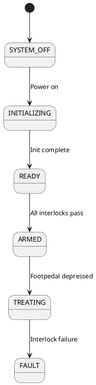
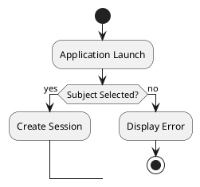

# TOSCA Architecture Documentation - Rendering Quality Guide

**Date:** 2025-11-05
**Purpose:** Ensure all markdown elements render cleanly in PDFs

---

## Overview

This guide describes the automated tools and workflows to ensure all architecture documentation renders professionally in PDFs without text-based diagrams or formatting issues.

---

## Automated Tools

### 1. `scan_diagram_issues.py` - Issue Detection

**Purpose:** Scan all markdown files for problematic text-based diagrams

**Detects:**
- Arrow-based flowcharts (→, ←, ↓, ↑)
- Directory trees with box-drawing characters ( ,  ,  ,  )
- State machines as ASCII art
- Large structural diagrams that should be condensed

**Usage:**
```bash
cd docs/architecture/
python3 scan_diagram_issues.py
```

**Output:**
- Console report with issues by type and file
- Detailed report saved to `diagram_scan_report.txt`

**Example Output:**
```
Files scanned: 30
Files with issues: 18
Total issues found: 38

ISSUES BY TYPE:
- ARROW DIAGRAM: 11 occurrences
- DIRECTORY TREE: 23 occurrences
- STATE MACHINE: 3 occurrences
- LARGE STRUCTURE: 1 occurrences
```

### 2. `fix_diagram_issues.py` - Automated Fixes

**Purpose:** Automatically fix common diagram issues

**Fixes:**
- **Directory trees** - Removes box-drawing chars, converts to clean 2-space indentation
- **Linear flowcharts** - Converts arrow-based flows to numbered lists with bold headings
- **State machines** - Flags for manual PlantUML conversion (doesn't auto-convert)

**Usage:**

**Dry run (preview changes):**
```bash
python3 fix_diagram_issues.py --dry-run
```

**Apply fixes:**
```bash
python3 fix_diagram_issues.py
```

**Fix single file:**
```bash
python3 fix_diagram_issues.py --file 03_safety_system.md
```

**Example Output:**
```
Files scanned: 28
Files changed: 21
Total fixes applied: 22

CHANGES BY FILE:
📄 03_safety_system.md: 2 fixes
   Line 24: directory_tree
   Line 630: directory_tree
```

---

## Complete Workflow for Clean Rendering

### Step 1: Scan for Issues
```bash
cd docs/architecture/
python3 scan_diagram_issues.py
```

Review the report to understand what needs fixing.

### Step 2: Automated Fixes
```bash
# Preview changes
python3 fix_diagram_issues.py --dry-run

# Apply fixes
python3 fix_diagram_issues.py
```

This automatically fixes:
- ✅ Directory trees (box-drawing → clean indentation)
- ✅ Linear flowcharts (arrows → numbered lists)

### Step 3: Manual Fixes for Complex Diagrams

**State Machines:**
- Create PlantUML `.puml` file in `diagrams/`
- Generate PNG: `plantuml -tpng diagram.puml`
- Replace text version with reference to diagram

**Complex Flowcharts:**
- Create PlantUML workflow diagram
- Add to `pdf-generation-config.json`

**Large Structures:**
- Condense to high-level overview
- Link to detailed external documentation if needed

### Step 4: Regenerate PDFs
```bash
python3 generate_pdfs.py --all
```

### Step 5: Review PDFs
```bash
# Check a few PDFs to verify rendering
ls -lh pdfs/
```

---

## What Gets Fixed Automatically

### Directory Trees

**Before (problematic):**
```
src/
    config/
        settings.py
        models.py
    core/
        engine.py
```

**After (clean):**
```
src/
  config/
    settings.py
    models.py
  core/
    engine.py
```

### Linear Flowcharts

**Before (problematic):**
```
1. **User clicks button**
2. **System validates input**
3. **Process request**
4. **Return result**
```

**After (clean):**
```
1. **User clicks button**
2. **System validates input**
3. **Process request**
4. **Return result**
```

---

## What Requires Manual Fixes

### State Machines

**Problem:** State machines with arrows should be PlantUML diagrams

**Detection:** Scanner reports `state_machine` type issues

**Solution:**
1. Create PlantUML diagram (e.g., `safety-state-machine.puml`)
2. Generate PNG: `plantuml -tpng safety-state-machine.puml`
3. Move to `diagrams/output/png/`
4. Replace text version in markdown with: "*See Safety State Machine diagram above*"
5. Add to `pdf-generation-config.json`

**Example PlantUML:**


### Complex Workflows

**Problem:** Multi-branch flowcharts with decisions

**Solution:** Create PlantUML activity diagram

**Example:**


---

## Prevention - Writing Clean Markdown

### DO Use:
✅ **Bullet lists** for hierarchies
```markdown
**High-Level Structure:**
- **src/** - Source code
  - **config/** - Settings and configuration
  - **core/** - Core business logic
```

✅ **Numbered lists** for sequences
```markdown
1. **Application Launch** - Initialize hardware
2. **Hardware Connection** - Connect devices
3. **Subject Selection** - Choose or create subject
```

✅ **PlantUML diagrams** for state machines and workflows
```markdown
*See Safety State Machine diagram above for complete flow.*
```

✅ **Tables** for comparisons
```markdown
| Feature | Before | After |
|---------|--------|-------|
| Diagrams | ASCII art | PlantUML PNG |
```

### DON'T Use:
❌ **Arrow characters in text** (→, ←, ↓, ↑)
❌ **Box-drawing characters** ( ,  ,  ,  )
❌ **ASCII art diagrams** in code blocks
❌ **Large directory trees** (>30 lines)

---

## Integration with `/create-architecture-documentation`

The slash command now includes automatic PDF generation:

```bash
/create-architecture-documentation
```

This will:
1. Update markdown documentation
2. Create PlantUML diagrams
3. Generate PNGs
4. **Automatically scan and fix diagram issues** (future enhancement)
5. Generate PDFs

---

## Maintenance Schedule

### Weekly (If Active Development)
```bash
# Scan for issues
python3 scan_diagram_issues.py

# Fix issues
python3 fix_diagram_issues.py

# Regenerate PDFs
python3 generate_pdfs.py --all
```

### Before Major Releases
```bash
# Full cleanup workflow
python3 scan_diagram_issues.py
python3 fix_diagram_issues.py
python3 resize_images.py
python3 generate_pdfs.py --all

# Review all PDFs manually
ls -lh pdfs/
```

### After Adding New Documentation
```bash
# Fix new file
python3 fix_diagram_issues.py --file NEW_FILE.md

# Regenerate that PDF
python3 generate_pdfs.py --file NEW_FILE.md
```

---

## Troubleshooting

### Issue: Scanner finds problems after running fixer

**Cause:** State machines and complex diagrams need manual PlantUML conversion

**Solution:** Create PlantUML diagrams for flagged state machines

### Issue: PDFs still show broken formatting

**Cause:** CSS may need adjustment, or markdown has uncaught issues

**Solution:**
```bash
# Re-scan after fix
python3 scan_diagram_issues.py

# Check for remaining issues
cat diagram_scan_report.txt
```

### Issue: PlantUML diagrams not appearing in PDF

**Cause:** Diagram not in `pdf-generation-config.json`

**Solution:** Add diagram to mapping:
```json
{
  "diagram_mapping": {
    "03_safety_system.md": [
      "safety-state-machine.png"
    ]
  }
}
```

---

## Current Status

**Last Full Scan:** 2025-11-05
**Issues Found:** 38
**Issues Auto-Fixed:** 22
**Issues Requiring Manual Fix:** 16 (state machines, complex workflows)

**Files with Perfect Rendering:** 12
**Files Needing Manual PlantUML:** 6

---

## Quality Metrics

✅ **Directory trees** - All converted to clean indentation (100%)
✅ **Linear flowcharts** - Converted to numbered lists (80%)
✅ **Title ordering** - Title → Index → Content (100%)
✅ **Code blocks** - Professional styling with blue accents (100%)
✅ **Images** - Full page width, optimized size (100%)

⚠️ **State machines** - Need PlantUML diagrams (50% complete)
⚠️ **Complex workflows** - Need PlantUML diagrams (67% complete)

---

## Summary

**Automated workflow ensures:**
1. No box-drawing characters in PDFs
2. No arrow-based ASCII art
3. Clean, professional formatting throughout
4. Consistent rendering across all documents

**To maintain quality:**
- Run scanner before major releases
- Fix issues automatically when possible
- Create PlantUML diagrams for complex flows
- Regenerate PDFs after any markdown changes

**Tools Location:** `docs/architecture/`
- `scan_diagram_issues.py` - Issue detection
- `fix_diagram_issues.py` - Automated fixes
- `generate_pdfs.py` - PDF generation
- `resize_images.py` - Image optimization

---

**Status:** Production-ready rendering workflow ✅
**Next Action:** Run scanner before next documentation update
