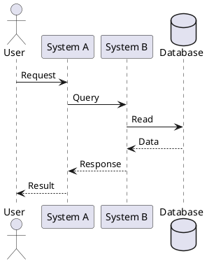
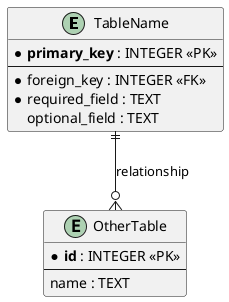

# TOSCA Architecture Diagrams

**Last Updated:** 2025-11-04
**Purpose:** Diagram-as-code sources for automated architecture documentation generation

---

## Overview

This directory contains PlantUML diagram sources (`.puml` files) for TOSCA architecture documentation. Diagrams are version-controlled as code and can be automatically generated into images (PNG/SVG) for documentation.

---

## Diagram Inventory

### C4 Model Diagrams

| File | Description | Type |
|------|-------------|------|
| `c4-01-system-context.puml` | System context: TOSCA and external systems | Context |
| `c4-02-container.puml` | Container architecture: PyQt6 UI, Core, HAL, Database | Container |
| `c4-03-component-core.puml` | Application Core components: Safety, Session, Protocol Engine | Component |
| `c4-04-component-hal.puml` | Hardware Abstraction Layer: Camera, Laser, TEC, Actuator, GPIO | Component |

### Sequence Diagrams

| File | Description |
|------|-------------|
| `sequence-treatment-workflow.puml` | Normal treatment workflow sequence |

### Data Architecture Diagrams

| File | Description |
|------|-------------|
| `database-schema-erd.puml` | Entity-Relationship Diagram (ERD) for SQLite database |
| `data-architecture.puml` | Two-tier logging strategy (JSONL + SQLite) |

---

## Generating Diagrams

### Prerequisites

**Option 1: PlantUML JAR (Recommended)**
```bash
# Install Java Runtime (if not already installed)
# Download PlantUML JAR
wget https://sourceforge.net/projects/plantuml/files/plantuml.jar/download -O plantuml.jar

# Generate all diagrams
java -jar plantuml.jar -tpng *.puml
java -jar plantuml.jar -tsvg *.puml
```

**Option 2: PlantUML CLI (Node.js)**
```bash
# Install via npm
npm install -g node-plantuml

# Generate all diagrams
puml generate *.puml -o ./output
```

**Option 3: VS Code Extension**
- Install "PlantUML" extension by jebbs
- Open any `.puml` file
- Press `Alt+D` to preview diagram
- Right-click → "Export Current Diagram" to save image

**Option 4: Online Renderer (Quick Preview)**
- Visit: https://www.plantuml.com/plantuml/uml/
- Copy-paste `.puml` file content
- Click "Submit" to render

---

## Automated Generation Script

**Script:** `generate_diagrams.sh` (Linux/macOS) or `generate_diagrams.bat` (Windows)

```bash
#!/bin/bash
# generate_diagrams.sh

echo "Generating TOSCA architecture diagrams..."

# Check for PlantUML JAR
if [ ! -f "plantuml.jar" ]; then
    echo "Downloading PlantUML JAR..."
    wget https://sourceforge.net/projects/plantuml/files/plantuml.jar/download -O plantuml.jar
fi

# Generate PNG images (for documentation)
java -jar plantuml.jar -tpng *.puml -o ./output/png

# Generate SVG images (for web/scaling)
java -jar plantuml.jar -tsvg *.puml -o ./output/svg

echo "Diagrams generated in output/ directory"
```

**Windows Batch Script:**
```bat
@echo off
REM generate_diagrams.bat

echo Generating TOSCA architecture diagrams...

REM Check for PlantUML JAR
if not exist plantuml.jar (
    echo Please download plantuml.jar from https://plantuml.com/download
    echo and place it in this directory
    exit /b 1
)

REM Generate PNG images
java -jar plantuml.jar -tpng *.puml -o output\png

REM Generate SVG images
java -jar plantuml.jar -tsvg *.puml -o output\svg

echo Diagrams generated in output\ directory
```

---

## Diagram Maintenance Workflow

### 1. Modify Diagram Source

Edit the `.puml` file using any text editor:

```plantuml
@startuml Example
!include https://raw.githubusercontent.com/plantuml-stdlib/C4-PlantUML/master/C4_Context.puml

title My Architecture Diagram

Person(user, "User", "System operator")
System(system, "My System", "Does important things")

Rel(user, system, "Uses")

@enduml
```

### 2. Regenerate Images

```bash
# Regenerate all diagrams
./generate_diagrams.sh

# Or regenerate single diagram
java -jar plantuml.jar -tpng c4-01-system-context.puml
```

### 3. Commit Changes

```bash
git add docs/architecture/diagrams/*.puml
git add docs/architecture/diagrams/output/*.png
git commit -m "docs: update C4 context diagram with new external system"
```

---

## PlantUML Syntax Quick Reference

### C4 Model Elements

```plantuml
@startuml
!include https://raw.githubusercontent.com/plantuml-stdlib/C4-PlantUML/master/C4_Context.puml

' People
Person(alias, "Name", "Description")
Person_Ext(alias, "External Person", "Description")

' Systems
System(alias, "System Name", "Description")
System_Ext(alias, "External System", "Description")

' Containers
Container(alias, "Container Name", "Technology", "Description")
ContainerDb(alias, "Database Name", "Technology", "Description")

' Components
Component(alias, "Component Name", "Type", "Description")

' Relationships
Rel(from, to, "Label", "Optional tech details")
Rel_Down(from, to, "Label")
Rel_Up(from, to, "Label")
Rel_Left(from, to, "Label")
Rel_Right(from, to, "Label")

@enduml
```

### Sequence Diagrams



### Entity-Relationship Diagrams



---

## Integration with Documentation

### Embedding in Markdown

**GitHub Markdown (renders PlantUML automatically):**
```markdown

```

**Alternative: Link to online renderer:**
```markdown

```

### Documentation Build Pipeline

**Automated generation in CI/CD:**
```yaml
# .github/workflows/docs.yml
name: Generate Documentation

on:
  push:
    paths:
      - 'docs/architecture/diagrams/*.puml'

jobs:
  generate-diagrams:
    runs-on: ubuntu-latest
    steps:
      - uses: actions/checkout@v3

      - name: Install PlantUML
        run: |
          wget https://sourceforge.net/projects/plantuml/files/plantuml.jar/download -O plantuml.jar

      - name: Generate Diagrams
        run: |
          cd docs/architecture/diagrams
          java -jar ../../../plantuml.jar -tpng *.puml -o ./output/png
          java -jar ../../../plantuml.jar -tsvg *.puml -o ./output/svg

      - name: Commit Generated Images
        run: |
          git config user.name "Documentation Bot"
          git config user.email "bot@example.com"
          git add docs/architecture/diagrams/output/
          git commit -m "docs: auto-generate architecture diagrams" || echo "No changes"
          git push
```

---

## Diagram Design Guidelines

### 1. Clarity
- Use meaningful names for all elements
- Add notes to explain complex concepts
- Keep diagrams focused (one concept per diagram)

### 2. Consistency
- Use C4 model conventions (Person, System, Container, Component)
- Maintain consistent naming (match code/documentation)
- Use standard PlantUML styling

### 3. Maintainability
- Add comments to `.puml` files explaining non-obvious choices
- Include metadata (last updated, purpose) in diagram titles
- Version control diagram sources (not just generated images)

### 4. Accessibility
- Generate both PNG (documentation) and SVG (web/scaling)
- Include alt text in Markdown embeds
- Use high contrast colors for visibility

---

## Troubleshooting

### Issue: PlantUML JAR fails to generate

**Solution:**
```bash
# Check Java version (requires Java 8+)
java -version

# Update Java if needed (Windows)
# Download from https://www.oracle.com/java/technologies/downloads/

# Update Java if needed (Linux)
sudo apt update && sudo apt install default-jre
```

### Issue: Diagram not rendering in VS Code

**Solution:**
1. Install "PlantUML" extension by jebbs
2. Install Graphviz: `sudo apt install graphviz` (Linux) or `brew install graphviz` (macOS)
3. Restart VS Code

### Issue: Include directive not working (C4 model)

**Solution:**
- Ensure internet connection (includes download from GitHub)
- Use `!include` with full URL: `https://raw.githubusercontent.com/...`
- Alternative: Download C4-PlantUML locally and use relative path

---

## References

- [PlantUML Official Documentation](https://plantuml.com/)
- [C4 Model](https://c4model.com/)
- [C4-PlantUML GitHub](https://github.com/plantuml-stdlib/C4-PlantUML)
- [PlantUML VS Code Extension](https://marketplace.visualstudio.com/items?itemName=jebbs.plantuml)

---

**Maintained by:** Documentation Team
**Contact:** [Project Lead Email]
**Last Review:** 2025-11-04
